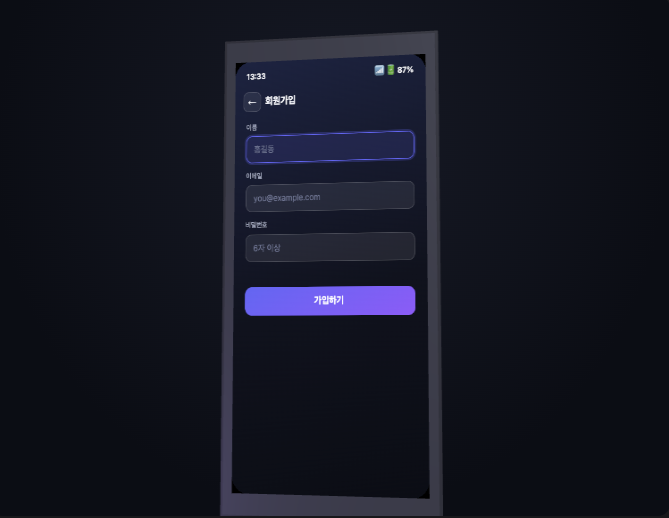
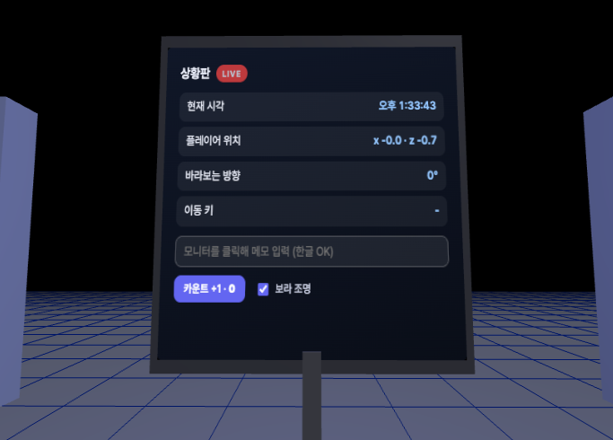
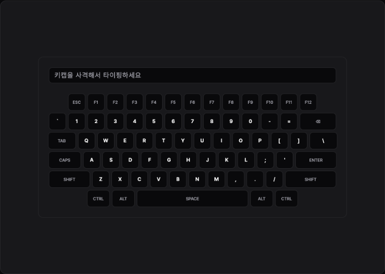
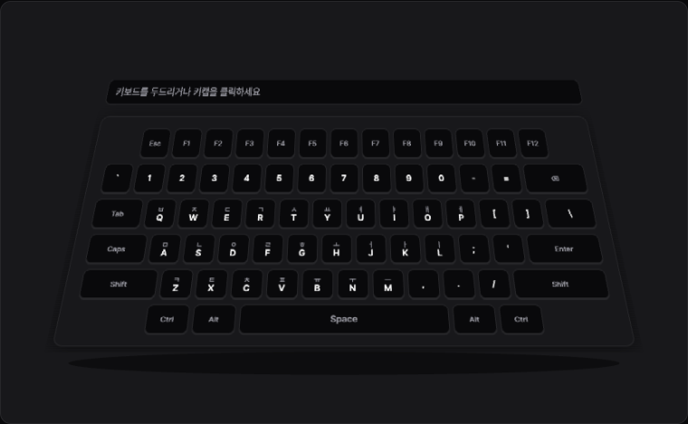

# CanvasUI

Skia(CanvasKit) 기반 캔버스 에디터를 직접 만들어 운영하고 있고, 캔버스 에디터 오픈소스에도 기여하고 있습니다. 이런 에디터를 만들다 보면 결국 텍스트 입력(IME), 폼, 접근성 같은 "DOM이 공짜로 주는 것들"을 canvas 위에서 다시 구현하는 벽에 부딪히는데, 이 문제를 실제 서비스에서 계속 풀고 있습니다.

그러던 중 2026년 5월 구글 I/O에서 HTML-in-Canvas API(`drawElementImage`)라는 게 공개됐습니다. DOM을 canvas에 그대로 그릴 수 있다는 얘기를 듣고, Chrome Canary에 플래그를 켜고 이것저것 만들어 봤습니다.

아직 실험 단계라 자료가 거의 없어서, 처음엔 카드 한 장 그리는 데도 한참 헤맸습니다. 브라우저가 허락하는 타이밍에만 그릴 수 있고, 요소를 숨기는 방법도 정해진 방식이 아니면 그냥 빈 화면이 나옵니다. 이런 시행착오를 `core/canvas-ui.js` 한 파일에 정리해 두고, 그 위에서 데모를 만들었습니다.

- 기본 HTML(input, select, checkbox, button 등)이 canvas에서 어떻게 표현되는지
- WICG 공식 예제 이식
- 기타 데모들 — FPS처럼 키보드를 쏴서 타이핑, three.js 폰 안에서 가입 폼 쓰기, WASD로 돌아다니는 3D 룸 등

## 데모

전체 데모: **https://greekr4.github.io/canvas-ui/**

| 3D 폰 앱 | three.js 연동 예제 |
|---|---|
|  |  |
| **FPS 키보드** | **3D 키보드** |
|  |  |

WICG 공식 예제 이식 — 회전 텍스트 / 파이 차트 / WebGL 큐브 / 인터랙티브 폼 / WebGPU 젤리 슬라이더

## 실행

**Chromium 146 이상이 필요합니다.** 플래그를 켜지 않으면 데모 대신 안내 문구만 표시됩니다.

1. Chrome Canary(또는 Chromium 146+)에서 `chrome://flags/#canvas-draw-element` → Enabled → 재시작
2. `index.html` 열기

## 쓰는 법

```html
<link rel="stylesheet" href="core/canvas-ui.css">
<script src="core/canvas-ui.js"></script>
<script>
  const api = CanvasUI.create({
    mount: '#app',
    html: '<div class="cui-card">…진짜 DOM…</div>',
    width: 640, height: 400,
    effect(ctx, src, t, api) { /* 촬영본(src)을 자유롭게 변형 */ },
  });
</script>
```

canvas에 그려진 input을 클릭하면 진짜 포커스가 가고, 한글 조합 중 글자까지 다음 프레임에 반영됩니다.

## 구조

```
core/canvas-ui.js        핵심 로직 — 그리기 타이밍, 클릭/키보드 전달 같은 까다로운 부분을 전부 처리
core/canvas-ui.css       테마 (CSS 변수로 커스텀)
components/*.js          문서 사이트의 데모 페이지들
vendor/three.min.js      three.js (로컬 동봉)
skills/html-in-canvas/   Claude용 스킬 (아래)
index.html               문서 사이트
```

## Claude 플러그인

```
/plugin marketplace add greekr4/canvas-ui
/plugin install canvas-ui@canvas-ui
```

스킬 본문: [`skills/html-in-canvas/SKILL.md`](skills/html-in-canvas/SKILL.md)

## 참고

2026-08-20, Chrome Canary 기준으로 확인했습니다. 실험 API라 빌드에 따라 동작이 다를 수 있습니다.
